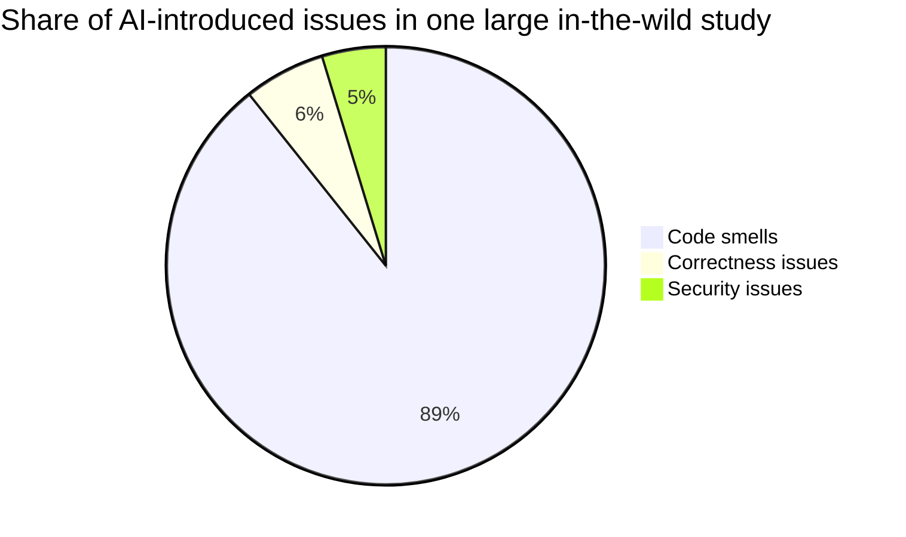
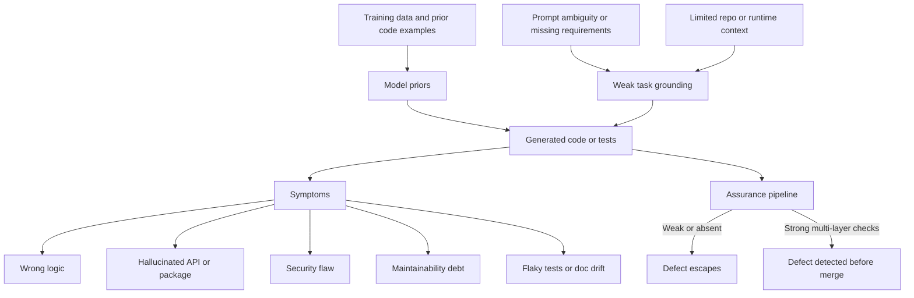
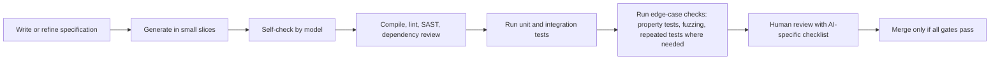

# Problems with AI-Written Code

## Executive summary

AI-generated code fails in ways that are now well documented across controlled benchmarks, large real-world repository studies, security analyses, and official platform guidance. The most consistently reported problem classes are not just functional bugs, but also hallucinated APIs and packages, incorrect assumptions about intent or environment, insecure patterns, maintainability debt, flaky or misleading tests, documentation drift, and social bias in human-facing logic. In one large in-the-wild study of explicitly AI-authored commits across more than 6,000 GitHub repositories, researchers found 484,366 AI-introduced issues; 89.3% were code smells, 6.0% correctness issues, and 4.7% security issues, affecting 3,946 repositories and 27,677 commits. In older controlled security work on Copilot, roughly 40% of generated programs in high-risk scenarios were vulnerable. Package hallucination studies found average hallucination rates of at least 5.2% for commercial models and 21.7% for open-source models, with over 205,000 unique hallucinated package names observed. citeturn19view4turn19view5turn13view1turn12view2

Because no programming language was specified, this report focuses on cross-language and cross-tool patterns. That said, the literature shows that defect distributions vary by language and ecosystem: for example, Python-heavy studies frequently surface dynamic-typing and undefined-reference issues, JavaScript/TypeScript studies surface scoping and path-handling issues, and some large security studies report higher vulnerability density in Python than in JavaScript or TypeScript. citeturn20view0turn20view2turn32search10

The core lesson for project guidelines is simple: treat AI as a fast, non-deterministic drafter, not as an authority. Official GitHub guidance explicitly warns reviewers to look for hallucinated APIs, ignored constraints, incorrect logic, deleted or skipped tests, fabricated dependencies, insecure fixes, and semantic changes that pass syntax checks but violate intent. DORA’s latest AI software-development research similarly reports a “verification tax”: time saved in drafting is often re-spent on auditing, and a 25% increase in AI adoption is associated with a 7.2% decrease in delivery stability, in part because AI makes it easier to produce larger, harder-to-review changes. citeturn6view0turn7view2turn11view0turn9view0

For practical guidelines, the highest-value controls are specification-first prompting, small-batch generation, mandatory automated tests and static analysis, dependency and licence checks, reproducible environments, and human review with explicit AI-specific checklists. Test generation is useful, but generated tests themselves must be checked for state pollution, flakiness, and shallow assertions. Security review must include SAST, dependency scanning, secret scanning, and dynamic techniques such as fuzzing. Concurrency, resource-safety, and edge-case behaviour need stronger-than-usual assurance because ordinary unit tests often miss them. citeturn27search0turn27search1turn27search18turn37view0turn14view3turn16view0

## Defect landscape

The literature now supports a broad taxonomy of defects in AI-written code. Empirical bug studies on LLM-generated code identify recurring patterns such as misinterpretation of requirements, syntax errors, missing corner cases, wrong input types, hallucinated objects, wrong attributes, incomplete generation, and prompt-biased code. Research on code hallucinations extends that into a broader defect model that includes dead or unreachable code, logical errors, robustness failures on edge cases, security vulnerabilities, and memory leaks. In practice, these categories overlap heavily: a hallucinated API often becomes a compile/runtime correctness defect; an underspecified prompt may produce wrong logic; a copied insecure idiom may compile and even pass weak tests while remaining vulnerable. citeturn33view0turn14view1turn14view0

The table below synthesises the main issue types you asked for. Severity and detection difficulty are analytical judgements based on the cited evidence, intended for project-guideline prioritisation rather than as universal absolutes.

| Issue type | Typical manifestation | Typical severity | Detection difficulty | Strongest controls |
|---|---|---|---|---|
| Functional bugs | Wrong outputs, failing edge cases, incomplete implementations, wrong input handling. citeturn33view0turn18view3 | High | Medium | Executable unit/integration tests, mutation testing, property-based tests, reviewer checks against specification. citeturn37view1turn28search0turn27search0 |
| Logic errors | Semantically wrong but plausible code, especially under ambiguous or contradictory requirements. citeturn18view3turn30search20 | High | High | Specification-first prompts, example-based acceptance tests, scenario tables, human domain review. citeturn30search20turn11view0 |
| Incorrect assumptions | Assumes non-existent files, outdated versions, wrong project structure, wrong runtime conditions. citeturn21view1turn25search0turn25search8 | Medium to High | High | Ground the model in repo/context, expose relevant files, pin environment assumptions, require explicit assumptions section in outputs. citeturn10search0turn7view1turn6view0 |
| Hallucinations | Non-existent APIs, fabricated identifiers, invented package names, unsupported claims in PR descriptions. citeturn14view2turn12view2turn12view9 | High | High | API/docs grounding, AST or symbol validation, package existence checks, PR-description verification. citeturn14view2turn12view2turn12view9 |
| Security vulnerabilities | Injection flaws, unsafe subprocess use, path traversal, unsafe format strings, hardcoded secrets, insecure dependencies. citeturn13view1turn20view1turn6view2turn7view2 | Critical | Medium to High | Secure coding standards, SAST/DAST, secret scanning, dependency review, threat modelling, manual secure code review. citeturn27search0turn27search1turn27search18turn6view2 |
| Performance regressions | Inefficient implementations, larger unstable changes, degraded operational stability and reviewability. Evidence is weaker and more heterogeneous than for correctness/security, but multiple studies treat efficiency and stability as first-class concerns. citeturn11view0turn9view0turn29view0 | Medium to High | High | Performance tests, profiling, batch-size limits, targeted optimisation review, benchmark suites. citeturn9view0turn29view0 |
| Concurrency and race conditions | Deadlocks, races, starvation, schedule-dependent failures that ordinary test suites miss. citeturn14view3 | Critical | Very High | Model checking, schedule exploration, stress tests, concurrency-specific review rules. citeturn14view3turn27search18 |
| Resource leaks | Unclosed resources, memory-safety faults, latent leaks, sanitizer-detectable low-level issues. citeturn14view1turn16view0 | High | High | Sanitizers, leak detectors, fuzzing, resource-lifecycle review, RAII/structured cleanup idioms. citeturn16view0turn28search1turn28search19 |
| Dependency and version issues | Hallucinated packages, unsupported versions, insecure or malicious dependencies, slopsquatting risk. citeturn12view2turn7view2turn25search8 | High | Medium | Dependency pinning, allowlists, lockfiles, registry existence checks, advisory scanning, review of new packages. citeturn7view2turn6view0turn6view2 |
| Licensing and IP issues | Output strikingly similar to existing code, missing attribution, incompatible licences. citeturn12view4turn26search1turn26search8 | High | Medium | Code-reference checks, licence scanners, provenance review, policy on public-code matches. citeturn26search1turn26search8turn26search16 |
| Test flakiness | Generated tests depend on randomness, ordering, or shared mutable state; flaky behaviour can be transferred from prompt context. citeturn13view4turn37view0 | Medium to High | Medium | Repeated execution, isolation, deterministic fixtures, anti-flakiness review, mutation coverage checks. citeturn37view0turn13view4 |
| Maintainability and readability debt | Duplicate code, broad exception handling, unused variables, generic structure, low refactoring, code smells. citeturn9view1turn9view2turn19view4turn12view10 | High over time | Medium | Linters, smell detectors, review for DRY/modularity, refactoring budgets, small PRs. citeturn19view4turn12view10turn11view0 |
| Documentation drift | Commit messages, PR descriptions, and generated docs that do not match the code. citeturn12view9turn36view0 | Medium | Medium to High | Verify docs/comments against diffs, require “evidence in diff” for claims, regenerate docs from checked artefacts where possible. citeturn12view9turn36view0 |
| Hidden biases | Discriminatory logic in human-facing code paths based on gender, age, race, region, or other protected attributes. citeturn13view5turn13view6 | High to Critical in affected domains | High | Fairness tests, metamorphic testing, domain-specific review, red-team prompts for protected attributes. citeturn13view5turn13view6 |

The chart above is from a large-scale study of AI-authored commits in public repositories. It is useful because it shows that the dominant near-term failure mode is often not an immediate crash or exploit, but maintainability debt that raises future defect probability and review burden. That matters for project guidelines: if you only gate on “tests pass”, you will miss the most common class of AI-introduced issues. citeturn19view4turn19view5turn11view0

## Root causes

The reported causes cluster into three layers: model/data causes, interaction/context causes, and assurance-process causes. On the model/data side, recent survey work traces many generated-code failures back to training-corpus imperfections, and formalises multiple propagation paths from bad or incomplete training data into generated defects. The same literature highlights that code LLMs can memorise and reuse problematic patterns from public code, including insecure idioms and licensed material. citeturn29view0turn12view4

Prompt ambiguity and missing context are repeatedly shown to be major defect drivers. A 2025 robustness study found that even minor ambiguity, incompleteness, or contradiction in task descriptions can materially degrade correctness and increase logical errors. DORA’s 2026 work reaches the same conclusion from production practice: poorly defined requests create longer, less successful trajectories; lack of internal context and fragmented tooling increase hallucinations and verification overhead; and AI tools often fail in the “last mile” of production integration when they do not have access to the right proprietary context. GitHub’s own Autofix documentation also notes that model performance degrades when context is truncated, the repository is large, or the alert requires multi-file reasoning. citeturn30search20turn30search10turn10search0turn7view1

Overconfidence is another recurring cause. DORA explicitly notes that current AI tools are poor at signalling uncertainty, forcing engineers to treat every interaction as potentially deceptive. More generally, hallucination research shows that models can be confidently wrong, and code-specific studies describe “counterfeit” incorrect programs that models think are correct and struggle to diagnose. This matters operationally because polished, fluent code or explanations can weaken reviewer scepticism and increase merge risk. citeturn31search1turn31search15turn12view8

The empirical API-misuse literature adds another root-cause layer: even when the model has seen a library family during training, it still struggles with intent misalignment, hallucinated members, missing required parameters, and redundant or semantically wrong calls. Evolving libraries make this worse, because the model is not necessarily referencing the live API surface. That aligns with community reports of Copilot suggesting package versions that do not exist, or reporting an incorrect dependency version even when the real value was in the workspace. citeturn34view0turn25search0turn25search8

Finally, many defects are not caused only by generation; they escape because assurance is too weak. Official GitHub guidance says AI-generated code should always be checked with CI, syntax checks, dependency management, code scanning, secret scanning, and human review. NIST’s SSDF and related minimum-testing guidance likewise call for code review, static analysis, dynamic analysis, software composition analysis, and even race-condition-capable scanners for multi-threaded software. When teams skip these layers, AI defects that are easy to generate and hard to eyeball become production problems. citeturn7view2turn6view2turn27search0turn27search18turn27search5

## Prevalence and examples

Prevalence figures are meaningful, but they are not directly comparable across papers because they measure different things: some studies test small code snippets under controlled prompts, some analyse secure-coding tasks, some analyse AI-authored repository commits, and others study generated tests, PR descriptions, or build scripts. The right way to use the numbers is directionally: they show which classes of failures recur across settings, not a single universal defect rate. citeturn13view1turn19view4turn12view10turn36view0

| Evidence snapshot | Scope | Key result | Why it matters |
|---|---|---|---|
| Pearce et al., *Asleep at the Keyboard?* citeturn13view1 | 1,689 Copilot-generated programs across 89 security scenarios | About 40% were vulnerable | Secure-looking code can still be insecure in a large fraction of high-risk prompts |
| Replication of the Copilot security study citeturn12view1 | Newer Copilot/CodeQL, Python focus | Confirms security weaknesses remain worth measuring | Security issues did not disappear with tool maturity |
| Package hallucination study citeturn12view2 | 576,000 samples, 16 code LLMs, two languages | Average hallucinated packages at least 5.2% for commercial and 21.7% for open-source models; 205,474 unique hallucinated names | Dependency verification must be a first-class control |
| In-the-wild AI technical debt study citeturn19view4turn19view5 | 304k+ AI-authored commits across 6k+ repos | 484,366 introduced issues; 89.3% smells, 6.0% correctness, 4.7% security; 9.1% of AI commits introduced issues | Maintainability debt is the dominant escape mode |
| AI-generated build-code study citeturn12view10turn17search4 | 387 PRs, 945 build files | 364 smells found; maintainability issues dominated; >61% of agentic PRs were merged with minimal intervention | Build/configuration code is a real risk surface, not just app logic |
| Message-code inconsistency study citeturn12view9 | 974 manually annotated agent-authored PRs | 406 PRs in the annotated set showed high inconsistency; most common issue was descriptions claiming unimplemented changes | Generated explanations and PR text require checking, not trust |
| CodeChange2NL hallucination study citeturn36view0 | Generated code reviews and commit messages | About 50% of generated code reviews and 20% of commit messages hallucinated | Documentation drift is not accidental edge noise |
| Bias studies citeturn13view5turn13view6 | Multiple LLMs on human-centred tasks | 13.47% to 49.10% of code in one study showed gender bias; another found all tested models exhibited severe social bias | Bias testing is necessary for user-facing or decision-support code |
| Flaky test studies citeturn13view4turn37view0 | Generated DB tests and Python test-generation tooling | 63% of manually inspected flaky tests in one study were due to unordered collections; other work shows flakiness can result from insufficient info or state pollution | Generated tests need their own QA process |
| DORA AI development report citeturn9view0turn10search1 | Survey data and interviews on AI in development | 25% more AI adoption linked to 7.2% lower delivery stability; 39% trust AI “a little” or “not at all” | The cost of verification shows up at team and delivery level |

Several concrete examples are especially useful for guideline-writing because they are easy to translate into review rules. In the large in-the-wild technical-debt study, researchers found a Copilot-authored commit in Microsoft’s `data-formulator` that interpolated a user-controlled table name directly into SQL, creating a potential SQL-injection vector; the issue remained for weeks before being refactored away. The same study reports a Claude-authored `ArchiveBox` change that silently caught all exceptions with `except: pass`, and another Claude-authored `Stirling-PDF` change that introduced an unused TypeScript variable that was fixed the next day. These are mundane, realistic failure modes: not exotic exploits, but ordinary review misses with long-tail maintenance or security costs. citeturn20view0turn20view4turn20view2

Community evidence, while anecdotal, is aligned with the research. In a GitHub Community discussion, a user reported Copilot suggesting package versions that did not exist; the accepted answer explained that Copilot may hallucinate package versions because it is not checking the live NuGet registry in real time. In another GitHub Community thread, a maintainer acknowledged Copilot reporting an incorrect `package.json` version that differed from the actual file, attributing it to the assistant using historical/popular data instead of the exact workspace content. On Stack Overflow, one user showed Copilot inventing a non-existent project named `TinyShop` when asked to explain a real solution, and a separate thread explicitly called out a hallucinated answer about Copilot/GPT token limits. These are not prevalence studies, but they are highly relevant examples of repo-grounding, versioning, and assumption failures that guidelines should anticipate. citeturn25search8turn25search0turn21view1turn21view2

Stack Overflow’s platform-level response is itself evidence. Its official policy states that generative-AI content is banned for posting because the average rate of correct answers is too low, and because plausible-looking but incorrect answers are easy to produce and hard to verify at scale. A related Meta Stack Overflow discussion about questions based on ChatGPT-generated code includes a moderator response stating that such code is “rarely” fit for purpose. This is not a formal benchmark, but it is a large operational signal from a programming-help platform that had to absorb the failure mode in practice. citeturn6view3turn21view0

Licensing and IP risks are rarer than routine correctness or maintainability defects, but they are not negligible. LiCoEval found that even top-performing models produced a non-negligible fraction of outputs strikingly similar to open-source implementations, roughly 0.88% to 2.01%, and that most models failed to provide accurate licence information, particularly for copyleft code. GitHub’s own Copilot documentation exposes “code referencing” and public-code-match controls, which is an implicit acknowledgement that provenance and licence review need operational support. citeturn12view4turn26search1turn26search8

## Detection and assurance

No single detection method is enough. The official guidance from GitHub, NIST, and OWASP is convergent: use layered verification that combines human review with multiple automated techniques. GitHub recommends starting with compile/test checks and static analysis, then reviewing context and intent, evaluating quality, reviewing dependencies, spotting AI-specific pitfalls, and automating as much as possible. NIST’s SSDF and minimum-testing guidance explicitly include code review, static and dynamic analysis, software composition analysis, and penetration testing; for multi-threaded code, NIST specifically recommends scanners capable of detecting race conditions. OWASP’s secure code review guidance recommends using automated findings to focus manual review, including dependency scanning and code quality metrics. citeturn6view0turn27search0turn27search18turn27search1

| Detection method | Best at catching | Weaknesses | Guideline implication |
|---|---|---|---|
| Compiler/type checker | Syntax errors, missing symbols, some type and import issues. citeturn19view2turn16view0 | Misses semantic errors and many security flaws | Always run before review; reject non-compiling AI output automatically |
| Linters and smell detectors | Style drift, unused code, broad exception handling, complexity, maintainability debt. citeturn19view4turn12view10 | Can be noisy; weak on deep intent errors | Make lint/smell regressions fail CI for AI-labelled contributions |
| SAST | Injection, unsafe subprocess use, path traversal, hardcoded secrets, many CWEs. citeturn6view2turn7view2turn27search18 | False positives and limited semantic context | Run on every PR; triage but do not skip because code “came from AI” |
| Dependency scanning/SCA | Vulnerable or malicious dependencies, unsupported versions. citeturn6view2turn7view2 | Cannot tell whether a package is logically appropriate | Check every newly introduced dependency and every version bump |
| Secret scanning | Leaked API keys, credentials, tokens. citeturn6view2 | Cannot catch every derived secret or logic flaw | Mandatory on repos receiving AI-generated code |
| Unit and integration tests | Functional regressions and contract violations. citeturn7view2turn37view1 | Often miss edge cases, concurrency, and performance regressions | Require AI outputs to come with tests or test updates |
| Property-based testing | Invariant violations, edge cases, data-structure and serialisation errors. citeturn28search0turn28search11 | Requires good properties and generators | Use for parsers, transforms, protocols, finance rules, access-control invariants |
| Fuzzing | Crash bugs, parser issues, memory-safety problems, unexpected input handling. citeturn28search1turn28search19turn16view0 | Less direct for high-level business logic | Add for input-heavy, security-sensitive, or native-code components |
| Model checking/formal methods | Concurrency bugs, state-space errors, protocol violations. citeturn14view3 | Higher setup cost and narrower applicability | Use selectively for concurrent, safety-critical, or protocol-heavy modules |
| Code review | Intent mismatches, awkward abstractions, domain-rule failures, bias, doc drift. citeturn27search1turn12view9turn13view6 | Human attention is scarce; large PRs are hard | Keep AI PRs small and require explicit reviewer prompts/checklists |
| Repeated test execution | Flaky tests, hidden randomness, state pollution. citeturn37view0turn13view4 | Costlier CI and still probabilistic | Re-run generated tests, especially if AI authored them |

A useful pattern for project guidelines is to separate **syntactic trust**, **behavioural trust**, and **contextual trust**. Syntactic trust means the code compiles, formats, and passes linters. Behavioural trust means it passes tests, including edge-case and property-based tests where appropriate. Contextual trust means the code matches the specification, library versions, architecture, data-governance rules, and security model of the actual project. AI-written code often clears the first layer and sometimes the second, while still failing the third. citeturn7view2turn11view0turn34view0

Generated tests deserve special caution. CoverUp and related work show that LLM-generated tests can pollute shared state, rely on incorrect assumptions, and become flaky if the model lacks necessary information; the tool compensates by repeated execution and by repairing or disabling problematic tests. Another industrial/open-source DBMS study found that both LLMs sometimes transfer flakiness from prompt context into newly generated tests, with 63% of flaky tests in one sample caused by reliance on non-guaranteed ordering. This means “the AI also wrote tests” is not proof of reliability. citeturn37view0turn13view4

## Mitigation and project guidelines

The most effective mitigation strategy is **not** “better prompts only”. The best results in the literature and official guidance come from combining prompt discipline with downstream verification. Structured prompting helps, but it does not replace tests, scanners, and review. For instance, TDD-Bench Verified improves test generation by decomposing the task, supplying the right code context, and applying symbolic repair; GitHub’s review guidance similarly emphasises human review plus automated checks; and DORA recommends doubling down on fast, high-quality feedback loops because AI makes it easier to produce large volumes of code quickly. citeturn37view1turn6view0turn9view0turn10search1

### Recommended delivery workflow

A specification-first approach should be mandatory for non-trivial work. The prompt or task should state inputs, outputs, invariants, edge cases, performance/security constraints, acceptable dependencies, target runtime, and what must not change. Studies on ambiguous and incomplete prompts show that unclear task descriptions materially degrade correctness, while DORA’s “workflow gap” findings show that AI frequently performs well at prototyping but struggles when production constraints are implicit rather than explicit. citeturn30search20turn11view0

Prompts should be grounded, narrow, and version-aware. If you want a package, API, or framework used, say which one and, where possible, provide the exact docs or code context. GitHub’s own docs recommend checking whether suggested dependencies exist, are maintained, and are licensed compatibly, and specifically warn about hallucinated or suspicious packages and slopsquatting. Research on package hallucinations and API misuse strongly supports this: the model is often guessing from pattern memory rather than consulting live registries or exact repository reality. citeturn6view0turn12view2turn34view0turn25search8

Generated changes should be kept small by policy. DORA finds that large AI-assisted changes are slower to review and more destabilising, and the security-of-generated-patches literature finds that more files changed and more generated lines are associated with greater vulnerability risk. “One prompt, one mega-PR” is therefore exactly the wrong operating model. citeturn9view0turn11view0turn19view3

Security controls should be explicit rather than implied. Your project guidelines should require that AI-generated code never bypasses the normal secure-development stack: SAST, dependency review, secret scanning, checked lockfiles, and manual security review for auth, input handling, file paths, subprocesses, query building, crypto, and deserialisation. Where code is human-facing or decision-supporting, fairness and protected-attribute testing should be part of the definition of done. citeturn6view2turn7view2turn27search0turn27search1turn13view5turn13view6

### Actionable checklist for project guidelines

The checklist below is written so it can be pasted almost directly into an internal engineering standard.

**Before generation**

- [ ] Require an explicit task spec: goal, inputs, outputs, acceptance criteria, invariants, error conditions, performance budget, security constraints, and allowed dependencies. Ambiguous or incomplete specifications materially increase logic errors. citeturn30search20turn11view0
- [ ] Require the author to attach or reference the exact files, APIs, schemas, and versions the model should use. Context gaps and truncation are known failure sources. citeturn10search0turn7view1
- [ ] For dependency-using tasks, require an allowlist or at least a registry-verification step for every new package and version. citeturn12view2turn25search8turn6view0
- [ ] For regulated or proprietary systems, forbid pasting sensitive code/data into tools not approved by policy. DORA recommends formal acceptable-use policies. citeturn9view0turn10search1

**During generation**

- [ ] Generate in small, reviewable slices rather than whole subsystems. Larger AI-generated changes are harder to review and are associated with more instability and vulnerability risk. citeturn9view0turn19view3
- [ ] Ask the model to list assumptions, unresolved ambiguities, and risks before or alongside code. This counteracts silent incorrect assumptions. citeturn11view0turn31search1
- [ ] Ask for tests and failure cases as well as implementation, but do not trust generated tests without separate validation. citeturn37view0turn13view4
- [ ] Prefer spec-first or test-first generation for new behaviour, and repair-oriented prompts for narrow edits. TDD-oriented pipelines can outperform unconstrained agent loops. citeturn37view1

**Before commit**

- [ ] Reject any AI-generated code that does not compile or type-check. citeturn19view2turn16view0
- [ ] Run linters and smell detectors; fail on newly introduced broad exception handling, unused variables/imports, obviously duplicated code, or unexplained complexity increases. These are among the most common real-world AI-introduced issues. citeturn19view4turn20view1turn9view2
- [ ] Run SAST, secret scanning, and dependency scanning on every AI-authored change. citeturn6view2turn7view2turn27search18
- [ ] Verify every new dependency exists, is maintained, is at a real published version, and is licence-compatible. citeturn6view0turn12view4turn25search8
- [ ] For risky domains, add repeated execution, fuzzing, property-based testing, or model checking as appropriate. citeturn37view0turn28search1turn28search0turn14view3

**In code review**

- [ ] Require reviewers to check that the code matches the stated intent, not merely that it “looks reasonable”. GitHub explicitly warns that syntactically valid suggestions may still change semantics. citeturn7view2
- [ ] Require reviewers to inspect any AI-written tests for flakiness, randomness, shared-state pollution, and shallow assertions. citeturn37view0turn13view4
- [ ] Require reviewers to verify PR descriptions, commit messages, and generated documentation against the actual diff. citeturn12view9turn36view0
- [ ] For user-facing logic, require bias/fairness review against protected attributes and edge personas. citeturn13view5turn13view6
- [ ] If public-code matching is enabled, review code references and licence details before merge. citeturn26search1turn26search8turn26search16

**After merge**

- [ ] Track defect escape rate, rework/churn, duplicate-code growth, and rollback/change-failure metrics for AI-authored changes separately from other changes. AI’s long-term cost often appears as debt and churn rather than immediate failure. citeturn9view1turn9view2turn11view0
- [ ] Preserve provenance where possible: mark AI-authored commits or PRs and retain prompts/configuration for auditability. GitHub’s cloud-agent guidance explicitly values traceability. citeturn6view2

## Tooling gaps and research directions

Current tooling remains strongest on syntax, common CWEs, and simple test execution, but much weaker on intent, repo-specific assumptions, concurrency correctness, performance regressions, and subtle documentation drift. The CONCUR benchmark exists precisely because ordinary sequential-code benchmarks and common metrics such as CodeBLEU do not reliably capture concurrent correctness. The CodeChange2NL work shows that even detecting hallucinated code reviews or commit messages remains mediocre when using single metrics. And DORA’s research suggests that quality problems are shifting reviewer effort and organisational workload, not just author effort. citeturn14view3turn36view0turn11view0

Research is moving in several promising directions. One thread uses richer grounding and symbolic/contextual aids, such as API documentation, AST-based validation, or symbolic repair, to catch hallucinated symbols and improve tests or patches. Another thread studies real-world AI-authored repositories instead of synthetic prompts, which is important because the dominant problems in production often look like debt accumulation, review overload, and configuration/build smells rather than flashy benchmark failures. A third thread is trying to make uncertainty and trust measurable, because today’s tools are still weak at telling you when they do not know. citeturn14view2turn37view1turn18view0turn31search1

The most important open tooling gap for engineering teams is **context verification**. Many current failures are not because the model lacks general coding skill, but because it was not forced to prove that it used the right repository files, versions, contracts, schemas, or runtime assumptions. Guidelines should therefore insist on “evidence-bearing” AI workflows: if the tool used a file, show which file; if it used a package, show the exact published version; if it claims a PR does X, point to the diff hunk that does X. This is where the next generation of practical safeguards is likely to matter most. citeturn25search0turn25search8turn12view9turn6view0

### Open questions and limitations

The evidence base is now strong enough to support robust engineering guidelines, but some areas remain less mature than others. Performance regressions, resource leaks in managed-language projects, and explicit CVE attribution to AI-authored source code are less consistently reported than correctness, maintainability, security patterns expressed as CWEs, and dependency hallucinations. Public vulnerability databases do not yet provide a stable, standardised “AI-authored” field, so the strongest security evidence today still comes from CWE-based academic and platform studies rather than from definitive AI-attributed CVE counts. citeturn19view0turn19view2turn32search10

The most defensible conclusion, however, is already clear: the problem with AI-written code is not a single “bug rate”. It is a **risk profile**. AI makes it cheaper to produce code, tests, configs, and documentation, but it also makes it cheaper to produce plausible, incomplete, insecure, context-wrong, and maintenance-heavy artefacts. Good guidelines therefore need to control not just *what gets generated*, but *how it is grounded, checked, reviewed, and audited before it becomes part of the system*. citeturn11view0turn6view0turn27search0