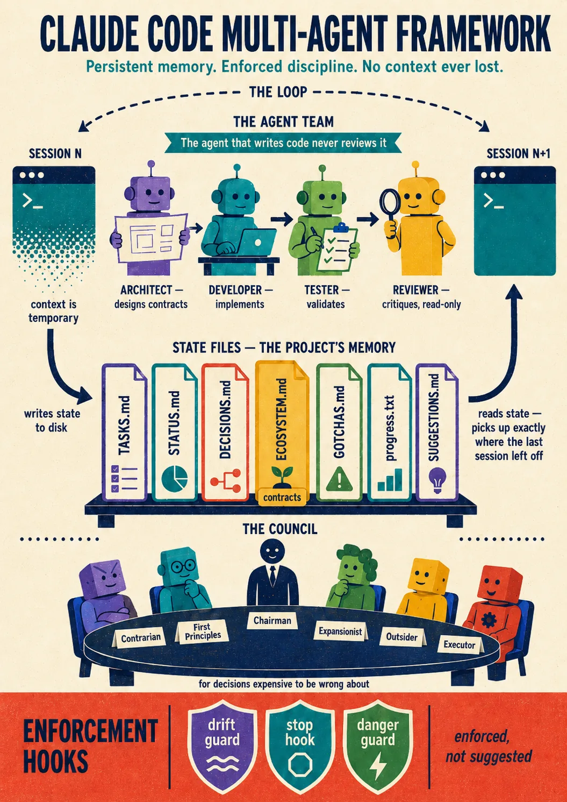
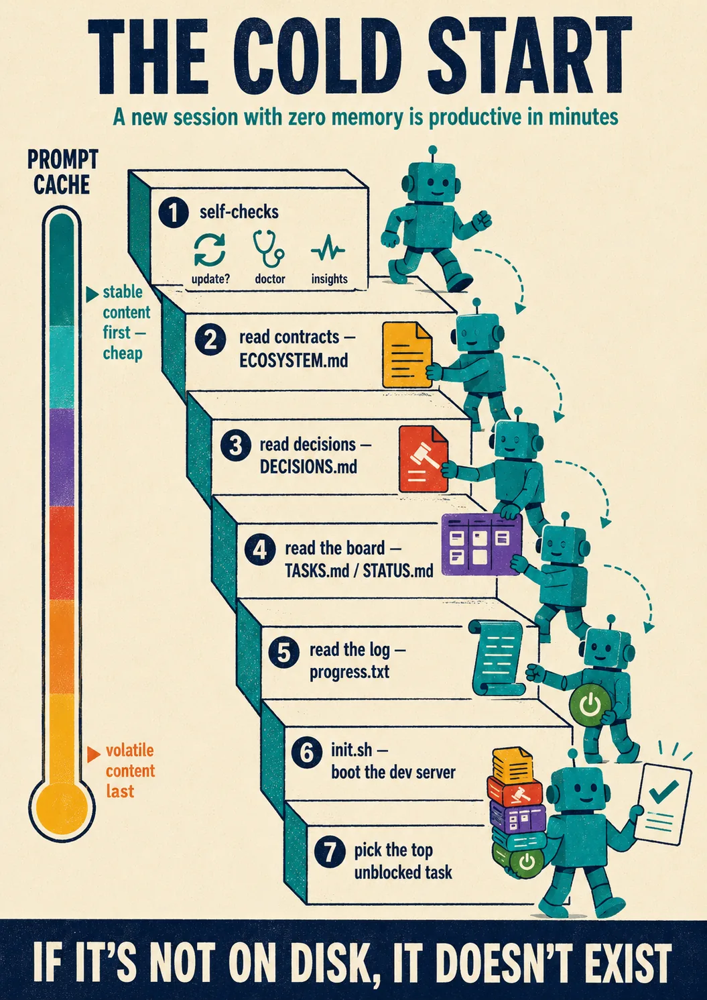
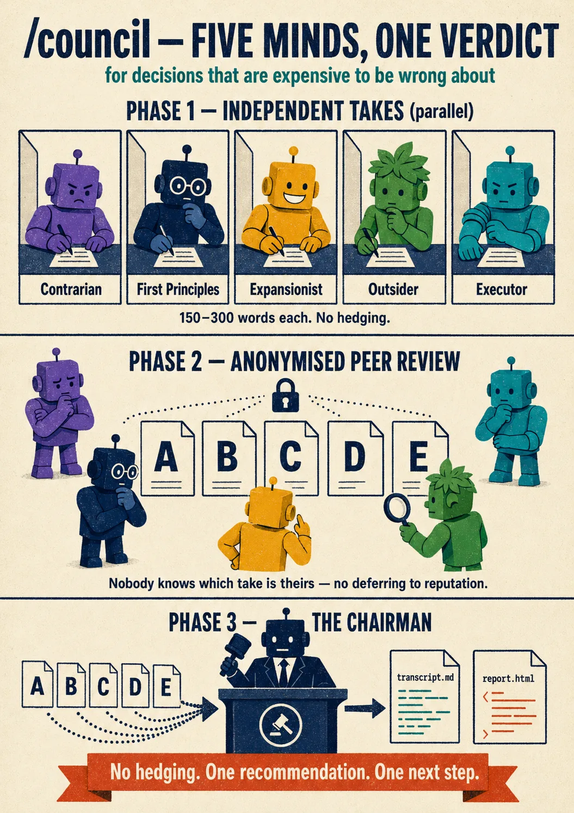
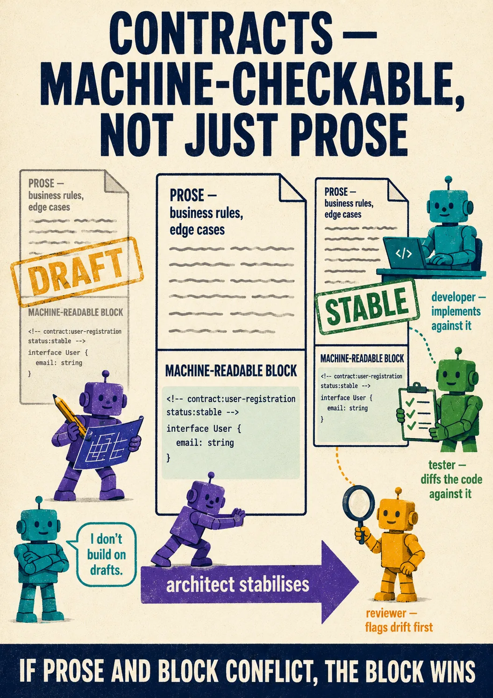
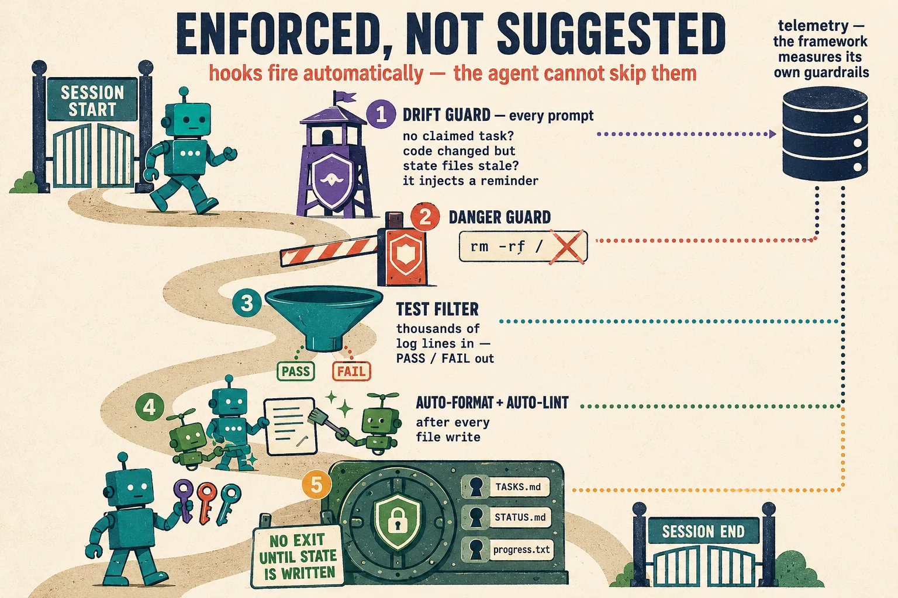
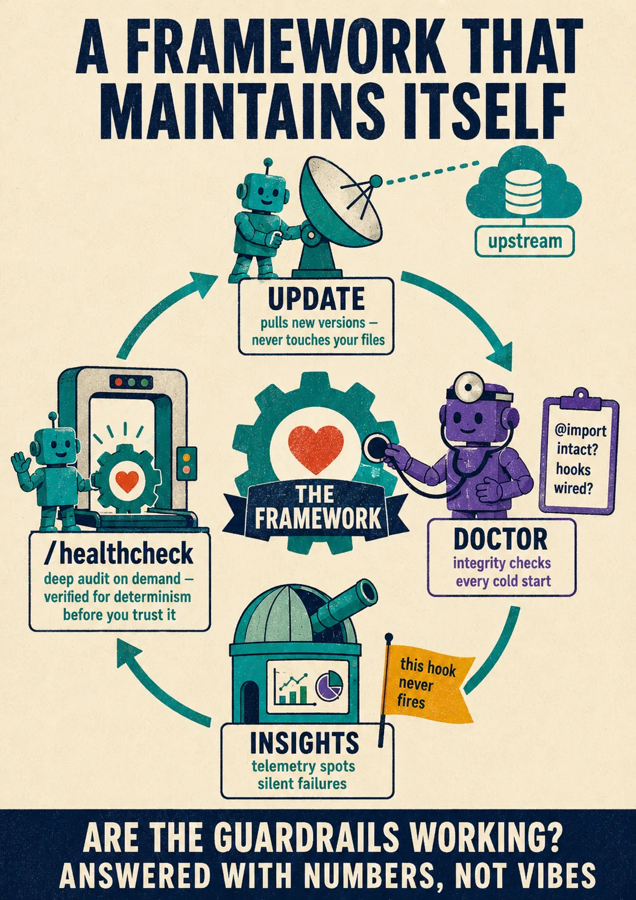

# Claude Code Multi-Agent Development Framework

A template repo that turns Claude Code into a team of specialists with persistent memory, enforced discipline, and a deliberation council for hard calls. Clone it into any project — agents, state files, hooks, slash commands, an update system, and a self-audit pipeline are ready to go. What one session writes, the next session reads. No context is ever lost.

<p align="center">
  
</p>


## Why This Exists

Claude Code sessions are disposable. Context fills up, compaction drops nuance, the next session starts from zero. On anything non-trivial, you waste hours re-explaining what was decided, what's in progress, and why things were built the way they were.

This framework makes that impossible. Every decision, every task status change, every lesson learned gets written to disk and enforced by hooks. A fresh session reads the state files and picks up exactly where the last one left off — mechanically, not aspirationally.

```
Session 1                          Session 2
   │                                  │
   ├─ Reads state files               ├─ Reads state files ◄── written by Session 1
   ├─ Does work                       ├─ Does work
   ├─ Updates state files ──────────► ├─ Updates state files ──────────►
   └─ Stop hook enforces              └─ Stop hook enforces
```


<p align="center">
  
</p>

## What Makes It Different

**Agents that act like a real team.** Four framework roles — Architect (Opus, designs contracts), Developer (Sonnet, implements), Tester (Sonnet, validates against contracts), Reviewer (Sonnet, read-only critique). The developer never reviews its own code. The reviewer is told the code was written by a separate AI and treats it with junior-developer skepticism. Each agent has explicit scope boundaries and knows what isn't its job.

**A council for high-stakes decisions.** When you're about to make a call that's expensive to be wrong about, run `/council`. Five independent advisors — Contrarian, First Principles, Expansionist, Outsider, Executor — give 150-300 word takes in parallel, then peer-review each other's responses *anonymised* (so they can't defer to whoever they think wrote what). A Chairman synthesises a verdict with no hedging plus a single concrete next step, and writes both a markdown transcript and a self-contained HTML report. Use it for "should I X or Y," "which option," architectural pivots — anything where you'd otherwise lose a day to second-guessing.

<p align="center">
  
</p>


**Contracts are machine-checkable, not just prose.** `ECOSYSTEM.md` contracts include machine-readable blocks (TypeScript types, JSON Schema, OpenAPI fragments) anchored with stable IDs. Per-file `contracts/*.md` is also supported for projects that prefer that layout. The Tester diffs implementations against these specs mechanically. The Reviewer flags drift. Contracts have `draft` and `stable` status — the Developer refuses to implement against a draft contract.

<p align="center">
  
</p>


**Stack-agnostic with auto-detect.** Hooks dispatch by manifest: `package.json` → npm, `pyproject.toml` → uv/pip, `go.mod` → go, `Cargo.toml` → cargo, `*.csproj` → dotnet. Auto-format and auto-lint pick the right tool by file extension (prettier, ruff, black, gofmt, rustfmt, dotnet format). No blessed default stack.

**Everything is enforced, not suggested.** A drift guard hook monitors mid-session and injects reminders when Claude stops following the framework. A Stop hook blocks session exit until state files are updated. Every commit must reference its task ID — commands verify linkage before allowing task transitions. The framework measures its own enforcement (drift guard fire rate, stop hook block rate) so you know if the guardrails are working.

<p align="center">
  
</p>


**Self-maintaining.** The framework knows how to update itself (`apply-update.sh` pulls upstream changes preserving project-owned files), check its own integrity (`doctor.sh` runs 8 invariants on cold start), surface long-term efficacy patterns (`insights/analyse.sh` flags hooks with zero events, agents that never escalate, etc.), and run a deep audit on demand (`/healthcheck`). Cold Start runs the update + doctor + insights checks every session, silently when there's nothing to report.

<p align="center">
  
</p>


**Two task lanes for different work.** Feature lane (Todo → In Progress → Review → Test → Done) for planned work. Bug-fix lane (Reported → Fixing → Verify → Done) for defects — no ceremony tax on a one-line hotfix. Bug reports include reproduction steps so the next session doesn't have to re-derive them.

**Structured requirements interviews.** The `/analyse` command uses Claude's AskUserQuestion tool for disciplined interviewing — batched questions with concrete options across four phases (scope, functional, non-functional, integration). No free-form "tell me about your project" that produces vague specs.

**Prompt-cache optimised.** The Cold Start reads stable content first (contracts, decisions) and volatile content last (tasks, status). This maximises cache hits across sessions. A rolling summary in the progress log compresses older session history into five bullets so new sessions get trajectory without reading thirty entries.

## Getting Started

1. **Clone** this repo into your new project directory
2. **Open** it in VS Code (or your IDE) with Claude Code
3. **Give Claude** the setup prompt:

```
Read .claude/claude-code-dev-framework.md completely.

Assess the current state of this project:
- Is there existing source code, or is this a greenfield project?
- Are there requirements documents (PRDs, specs, mockups) anywhere?
- What tech stack is present or implied?
- Is this a code project, or something else (orchestration, data
  pipeline, infrastructure, content)?

Based on your assessment, follow the appropriate setup scenario from
Section 12 (A for greenfield, B for an existing codebase). Start with
settings verification and ask me to restart the IDE. Once I confirm,
proceed through the remaining steps unattended.
```

4. **Restart VS Code** when prompted (loads permissions and hooks)
5. **Use the workflow**: `/analyse` → `/plan` → `/build` → `/test` → `/review`. Reach for `/council` when a decision is genuinely hard.

Setup customises the templates (fills in CLAUDE.md placeholders, adapts init.sh, uncomments your linter) — everything is pre-built, nothing is created from scratch.

## What's In The Box

### Agents (`.claude/agents/`)

**Framework agents** — the four-person team that does the actual work:

| Agent | Model | Role | Key Feature |
|-------|-------|------|-------------|
| Architect | Opus | Design, contracts, task breakdown | Contracts must include machine-readable blocks with draft/stable status |
| Developer | Sonnet | Implement features, fix bugs | Adversarial self-challenge + test suite run before handoff |
| Tester | Sonnet | Validate against contracts, write tests | Mechanical contract diff, bug reports with reproduction steps |
| Reviewer | Sonnet | Read-only code critique | Competitive framing triggers skeptical review, flags contract drift first |

**Council agents** — invoked only via `/council`, never standalone:

| Advisor | Role |
|---------|------|
| Contrarian | Hunts for what will fail |
| First Principles | Strips assumptions, often reframes the question |
| Expansionist | Finds upside others miss |
| Outsider | Fresh eyes, catches insider blind spots |
| Executor | Monday-morning feasibility |
| Chairman | Synthesises the council's output, writes transcript + HTML report |

All agents can escalate ambiguity via AskUserQuestion rather than guessing. All framework agents escalate to the Architect when a contract appears to be wrong.

### Commands (`.claude/commands/`)

| Command | What It Does |
|---------|-------------|
| `/analyse` | Structured interview → spec (uses AskUserQuestion across four phases) |
| `/plan` | Spec → contracts + tasks + decisions |
| `/build` | Delegates to developer subagent, verifies state files + commit linkage after |
| `/test` | Delegates to tester subagent, validates contracts mechanically |
| `/review` | Delegates to reviewer subagent, writes findings on its behalf |
| `/council` | Convenes the 5-advisor council on a high-stakes decision; produces transcript + HTML report |
| `/healthcheck` | Deep audit across framework integrity, code quality, contracts, and state |
| `/security` | Stack-agnostic security sweep: SAST, secret scan, dependency audit, config-surface audit |
| `/fleet` | Read-only status sweep across sibling framework projects (pin, layout era, skills, dirty count) |
| `/housekeeping` | Rolling summary, framework metrics, state file archiving, adopted-feedback reconciliation |
| `/wrapup` | Session-close checklist before context flush (commits, decisions, todos, memory candidates) |

### State Files (`.claude/`)

| File | What It Does |
|------|-------------|
| `TASKS.md` | Two-lane task board: feature lifecycle + bug-fix fast lane |
| `DECISIONS.md` | Decision log with rationale and rejected alternatives (per-file `decisions/` also supported) |
| `STATUS.md` | Dashboard: who's doing what, blockers, next up |
| `ECOSYSTEM.md` | Machine-readable contracts with draft/stable status (per-file `contracts/` also supported) |
| `claude-progress.txt` | Session log with rolling summary for fast skim |
| `GOTCHAS.md` | Lessons learned with encounter counts |
| `FRAMEWORK-SUGGESTIONS.md` | Ideas for improving the framework itself |

### Hooks (`.claude/hooks/`)

| Hook | Trigger | What It Does |
|------|---------|-------------|
| Drift guard | Every prompt | Detects mid-session framework drift, injects reminders |
| State enforcer | Session end | Blocks exit until `TASKS.md`, `STATUS.md`, `claude-progress.txt` updated |
| Dangerous commands | Before Bash | Blocks `rm -rf /`, `DROP TABLE`, fork bombs |
| Test filter | Before test commands | Filters test output to PASS/FAIL/ERROR, saves full log |
| Auto-lint | After file writes | Runs project linter (auto-detected by stack), Claude sees and fixes issues |
| Auto-format | After file writes | Runs the right formatter for the file's extension |
| Verify-deps | After manifest writes | Registry existence check on newly added dependencies (hallucination defence) |

### Framework Machinery (`.claude/framework/`)

| Component | What It Does |
|-----------|-------------|
| `update/` | `apply-update.sh` syncs upstream changes; `framework-manifest.txt` lists framework-owned paths so project files are never overwritten. Migration tooling for layout changes (`migrate-layout.sh`). Skills sync lives here too (`skills-sync.sh` / `skills-check.sh`). |
| `doctor/` | `doctor.sh` runs 12 integrity checks on every cold start; surfaces CRITICAL findings before session continues |
| `insights/` | `analyse.sh` aggregates telemetry (`hook-metrics`, drift events, etc.) and flags long-term anomalies (e.g. PostToolUse hooks with zero events) |
| `audit/` | `pattern-scan.sh` anti-pattern scanner; `config-security.sh` audits the harness's own config surface (settings, hooks, agents, skills) |
| `fleet/` | `fleet-status.sh` — the read-only sweep behind `/fleet` |
| `tests/` | bats + shellcheck regression harness for hooks, update system, insights, and audit scripts |
| `agent_docs/` | Reference docs loaded by agents on handoff (testing, building, conventions, architecture, behavioural principles) |
| `docs/` | Specs (from `/analyse`), plans (from `/plan`), archives, `ADOPTED-FEEDBACK.md` registry |
| `init.sh` | Cold Start step 10: stack-detected project init + dev-server boot |

### Skills (`.claude/skills/`)

Language/domain skills come from a **second upstream** — the
[CCMAF Skills](https://github.com/drushegh/CCMAF---Skills) catalogue
(29 skills: python, typescript, dotnet, rust, react, the Microsoft
business platform, game engines, security, accessibility, and more).
Skills are opt-in and selective: a project declares which it wants in
`.claude/.skills-version` (`SKILLS_SELECTED="python-development ..."`),
and `skills-sync.sh` copies only those directories. Three ownership
domains result: selected skill dirs belong to the skills repo
(overwritten on sync after a dirty-check), other `.claude/skills/` dirs
are yours, and `apply-update.sh` never touches skills at all.

- `skills-sync.sh --suggest` maps your detected stack to catalogue names.
- `skills-check.sh` runs at cold start: notifies adopters when their pin
  lags the catalogue, and suggests skills (throttled, declinable via a
  committed `.claude/.skills-declined`) to projects that never opted in.
- After a sync, a companion advisory lists sibling skills your selected
  ones cross-reference, so you can add depth where it's pointed to.

### Framework Self-Measurement (`framework-metrics.md`)

Hooks emit telemetry to `.claude/telemetry/events.jsonl`. `insights/rollup.sh` aggregates into `.claude/telemetry/.hook-metrics`. Every ~10 sessions, `/housekeeping` surfaces human-readable metrics: drift guard fire rate, stop hook block rate, review findings act rate, bug-fix cycle time, contract drift frequency. Without numbers, every improvement is a guess.

## Project Structure

```
CLAUDE.md                    Your project-specific instructions (required by Claude Code).
CLAUDE.framework.md          Framework-shipped cold start + rules (auto-loaded).
.gitignore
.claude/
  agents/framework/          Architect, Developer, Tester, Reviewer
  agents/council/            5 council advisors + Chairman
  commands/                  Slash commands (analyse, plan, build, test, review, council, etc.)
  hooks/                     Drift guard, state enforcer, auto-format, auto-lint, etc.
  framework/                 Update system, doctor, insights, audit, fleet, tests, docs, agent_docs
  skills/                    Synced skills (selected dirs) + your own local skills
  telemetry/                 Hook events + metrics (gitignored)
  council/                   Council deliberations (gitignored — local artefacts only)
  TASKS.md, STATUS.md, DECISIONS.md, ECOSYSTEM.md, GOTCHAS.md, ...    State files
  settings.json              Claude Code permissions, hook bindings, MCP config
01_Project/                  Your application source code and tests
02_solution/                 Deployable artifacts when distinct from source
```

All framework machinery and state files live under `.claude/`. Only `CLAUDE.md`, `CLAUDE.framework.md`, and `.gitignore` remain at the project root.

## Adapts to Non-Code Projects

The four framework roles are defaults for code development. For other project types, adapt the role names — the patterns (state files, hooks, Cold Start, contracts, council) work regardless:

| Project Type | Roles |
|-------------|-------|
| Orchestration/MCP toolkit | Planner, Scout, Configurator, Verifier |
| Data pipeline | Architect, Builder, Validator, Reviewer |
| Infrastructure-as-code | Architect, Builder, Tester, Reviewer |
| Content/docs | Planner, Writer, Editor, Reviewer |

## Deployment Exclusions

Framework files never ship. Add to `.dockerignore` / `.vercelignore` / equivalent:

```
.claude/
CLAUDE.md
CLAUDE.framework.md
```

Every framework file lives under `.claude/` (including state files and `claude-code-dev-framework.md`), so a single `.claude/` exclusion covers everything except the two root instruction files.

## Updating the Framework

Run `bash .claude/framework/update/check-updates.sh` to check upstream. Cold Start runs this automatically (silent if up-to-date). When an update is available, you get a summary of incoming commits and a yes/no prompt before `apply-update.sh` runs. The manifest at `.claude/framework/update/framework-manifest.txt` declares which paths are framework-owned and overwriteable; everything else is yours.

Skills update independently on their own pin: `skills-check.sh` (also run at Cold Start) flags when the skills catalogue has moved past your `.claude/.skills-version` pin, and `skills-sync.sh` pulls the refresh for your selected skills only.

After pulling an update, the next `/housekeeping` reconciles your `GOTCHAS.md` / `FRAMEWORK-SUGGESTIONS.md` against `.claude/framework/docs/ADOPTED-FEEDBACK.md` — entries you filed that upstream has since adopted get pruned instead of lingering as stale advice.

## Contributing

If you use this framework and find something that could be better, log it in `.claude/FRAMEWORK-SUGGESTIONS.md` during your project, then open a PR here with the improvement.

## License

MIT
